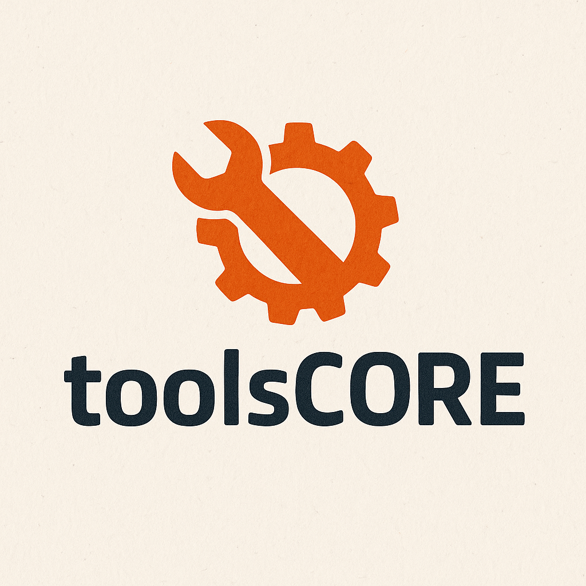

<p align="center">
  
</p>

<h1 align="center">Toolscore</h1>

<p align="center">
  <em>A Python package for evaluating LLM tool usage against gold standard specifications</em>
</p>

[](https://badge.fury.io/py/tool-scorer)
[](LICENSE)
[](https://pepy.tech/project/tool-scorer)
[](https://pypi.org/project/tool-scorer/)
[](https://github.com/yotambraun/toolscore/actions)
[](https://codecov.io/gh/yotambraun/toolscore)

Toolscore helps developers evaluate the tool-using behavior of LLM-based agents by comparing recorded tool usage traces against gold-standard specifications, producing detailed metrics and reports.

## What is Toolscore?

**Toolscore evaluates LLM tool usage** - it doesn't call LLM APIs directly. Think of it as a testing framework for function-calling agents:

- ✅ **Evaluates** existing tool usage traces from OpenAI, Anthropic, or custom sources
- ✅ **Compares** actual behavior against expected gold standards
- ✅ **Reports** detailed metrics on accuracy, efficiency, and correctness
- ❌ **Does NOT** call LLM APIs or execute tools (you capture traces separately)

**Use Toolscore to:**
- Benchmark different LLM models on tool usage tasks
- Validate that your agent calls the right tools with the right arguments
- Track improvements in function calling accuracy over time
- Compare agent performance across different prompting strategies

## Features

- **Trace vs. Spec Comparison**: Load agent tool-use traces (OpenAI, Anthropic, LangChain, or custom) and compare against gold standard specifications
- **Comprehensive Metrics Suite**:
  - Tool Invocation Accuracy
  - Tool Selection Accuracy
  - **NEW**: Tool Correctness (were all expected tools called?)
  - Tool Call Sequence Edit Distance
  - Argument Match F1 Score
  - **NEW**: Parameter Schema Validation (types, ranges, patterns)
  - Redundant Call Rate
  - Side-Effect Success Rate
  - Latency/Cost Attribution
  - **NEW**: Integrated LLM-as-a-judge semantic evaluation
- **Multiple Trace Adapters**: Built-in support for OpenAI, Anthropic Claude, LangChain, and custom JSON formats
- **CLI and API**: Command-line interface and Python API for programmatic use
- **Beautiful Console Output**: Color-coded metrics, tables, and progress indicators with Rich
- **Rich Output Reports**: Interactive HTML and machine-readable JSON reports
- **Pytest Integration**: Seamless test integration with pytest plugin and assertion helpers
- **Interactive Tutorials**: Jupyter notebooks for hands-on learning
- **Example Datasets**: 5 realistic gold standards for common agent types (weather, ecommerce, code, RAG, multi-tool)
- **Extensible Checks**: Validate side-effects like HTTP calls, file creation, database queries
- **Automated Releases**: Semantic versioning with conventional commits

## Why Toolscore?

| Feature | Toolscore | Manual Testing | Basic Assertions |
|---------|-----------|----------------|------------------|
| **Multiple LLM Support** | ✅ OpenAI, Anthropic, LangChain, Custom | ❌ | ❌ |
| **Comprehensive Metrics** | ✅ 10+ metrics | ❌ | ⚠️ Basic |
| **Schema Validation** | ✅ Types, ranges, patterns | ❌ | ❌ |
| **Tool Correctness** | ✅ Deterministic coverage check | ❌ | ❌ |
| **Semantic Evaluation** | ✅ Integrated LLM-as-a-judge | ❌ | ❌ |
| **Example Datasets** | ✅ 5 realistic templates | ❌ | ❌ |
| **Pytest Integration** | ✅ Native plugin | ❌ | ⚠️ Manual |
| **Beautiful Reports** | ✅ HTML + JSON | ❌ | ❌ |
| **Side-effect Validation** | ✅ HTTP, FS, DB | ❌ | ❌ |
| **Sequence Analysis** | ✅ Edit distance | ❌ | ❌ |
| **Interactive Tutorials** | ✅ Jupyter notebooks | ❌ | ❌ |
| **CI/CD Ready** | ✅ GitHub Actions | ⚠️ Custom | ⚠️ Custom |
| **Type Safety** | ✅ Fully typed | ❌ | ❌ |

## Installation

```bash
# Install from PyPI
pip install tool-scorer

# Or install from source
git clone https://github.com/yotambraun/toolscore.git
cd toolscore
pip install -e .
```

### Optional Dependencies

```bash
# Install with HTTP validation support
pip install tool-scorer[http]

# Install with LLM-as-a-judge metrics (requires OpenAI API key)
pip install tool-scorer[llm]

# Install with LangChain support
pip install tool-scorer[langchain]

# Install all optional features
pip install tool-scorer[all]
```

### Development Installation

```bash
# Install with development dependencies
pip install -e ".[dev]"

# Install with dev + docs dependencies
pip install -e ".[dev,docs]"

# Or using uv (faster)
uv pip install -e ".[dev]"
```

## ⚡ What's New in v1.1

Toolscore v1.1 focuses on **making evaluation incredibly easy and intuitive** with powerful new features:

### 🚀 Zero-Friction Onboarding (`toolscore init`)
Interactive project setup in 30 seconds. Choose your agent type (Weather, E-commerce, Code, RAG, Multi-tool), get pre-built templates and ready-to-use examples.

```bash
toolscore init
# Follow prompts → Start evaluating in 30 seconds
```

### ⚡ Synthetic Test Generator (`toolscore generate`)
Create comprehensive test suites automatically from OpenAI function schemas. Generates varied test cases with edge cases and boundary values - no manual test writing needed.

```bash
toolscore generate --from-openai functions.json --count 20
# Creates 20 test cases with normal + edge + boundary variations
```

### 📊 Quick Compare (`toolscore compare`)
Compare multiple models side-by-side in one command. See which model (GPT-4, Claude, Gemini, etc.) performs best on each metric with beautiful comparison tables.

```bash
toolscore compare gold.json gpt4.json claude.json gemini.json \
  -n gpt-4 -n claude-3 -n gemini-1.5
# Shows color-coded comparison table with overall winner
```

### 🔍 Interactive Debug Mode (`--debug`)
Step through failures one-by-one with guided troubleshooting. See exactly what went wrong and get actionable fix suggestions for each mismatch.

```bash
toolscore eval gold.json trace.json --debug
# Navigate mismatches interactively with context-specific suggestions
```

### 💡 Actionable Error Messages
Automatic failure detection with specific fix suggestions. No more guessing - get told exactly what to try next (use `--llm-judge`, check schemas, review arguments, etc.).

### 🎯 Tool Correctness Metric
Deterministic evaluation of whether all expected tools were called - goes beyond just checking individual call matches.

### 🧠 Integrated LLM-as-a-Judge
Semantic evaluation is now built into the core - just add `--llm-judge` flag to catch equivalent but differently-named tools (e.g., `search` vs `web_search`).

### 🔒 Parameter Schema Validation
Validate argument types, ranges, patterns, and constraints - catch type errors, out-of-range values, and missing required fields.

### 📦 Example Datasets
5 realistic gold standards for common agent types (weather, ecommerce, code assistant, RAG, multi-tool) - start evaluating in 30 seconds!

## Quick Start

### 🚀 30-Second Start

The fastest way to start evaluating:

```bash
# Install
pip install tool-scorer

# Initialize project (interactive)
toolscore init

# Evaluate (included templates)
toolscore eval gold_calls.json example_trace.json
```

Done! You now have evaluation results with detailed metrics.

### 5-Minute Complete Workflow

1. **Install Toolscore:**
   ```bash
   pip install tool-scorer
   ```

2. **Initialize a project** (choose from 5 agent types):
   ```bash
   toolscore init
   # Select agent type → Get templates + examples
   ```

3. **Generate test cases** (if you have OpenAI function schemas):
   ```bash
   toolscore generate --from-openai functions.json --count 20
   ```

4. **Run evaluation** with your agent's trace:
   ```bash
   # Basic evaluation
   toolscore eval gold_calls.json my_trace.json --html report.html

   # With semantic matching (catches similar tool names)
   toolscore eval gold_calls.json my_trace.json --llm-judge

   # With interactive debugging
   toolscore eval gold_calls.json my_trace.json --debug
   ```

5. **Compare multiple models:**
   ```bash
   toolscore compare gold.json gpt4.json claude.json \
     -n gpt-4 -n claude-3
   ```

6. **View results:**
   - Console shows color-coded metrics
   - Open `report.html` for interactive analysis
   - Check `toolscore.json` for machine-readable results

**Want to test with your own LLM?** See the [Complete Tutorial](TUTORIAL.md) for step-by-step instructions on capturing traces from OpenAI/Anthropic APIs.

### Command Line Usage

```bash
# ===== GETTING STARTED =====

# Initialize new project (interactive)
toolscore init

# Generate test cases from OpenAI function schemas
toolscore generate --from-openai functions.json --count 20 -o gold.json

# Validate trace file format
toolscore validate trace.json

# ===== EVALUATION =====

# Basic evaluation
toolscore eval gold_calls.json trace.json

# With HTML report
toolscore eval gold_calls.json trace.json --html report.html

# With semantic matching (LLM-as-a-judge)
toolscore eval gold_calls.json trace.json --llm-judge

# With interactive debugging
toolscore eval gold_calls.json trace.json --debug

# Verbose output (shows missing/extra tools)
toolscore eval gold_calls.json trace.json --verbose

# Specify trace format explicitly
toolscore eval gold_calls.json trace.json --format openai

# Use realistic example dataset
toolscore eval examples/datasets/ecommerce_agent.json trace.json

# ===== MULTI-MODEL COMPARISON =====

# Compare multiple models side-by-side
toolscore compare gold.json gpt4.json claude.json gemini.json

# With custom model names
toolscore compare gold.json model1.json model2.json \
  -n "GPT-4" -n "Claude-3-Opus"

# Save comparison report
toolscore compare gold.json *.json -o comparison.json
```

### Python API

```python
from toolscore import evaluate_trace

# Run evaluation
result = evaluate_trace(
    gold_file="gold_calls.json",
    trace_file="trace.json",
    format="auto"  # auto-detect format
)

# Access metrics
print(f"Invocation Accuracy: {result.metrics['invocation_accuracy']:.2%}")
print(f"Selection Accuracy: {result.metrics['selection_accuracy']:.2%}")

sequence = result.metrics['sequence_metrics']
print(f"Sequence Accuracy: {sequence['sequence_accuracy']:.2%}")

arguments = result.metrics['argument_metrics']
print(f"Argument F1: {arguments['f1']:.2%}")
```

### Pytest Integration

Toolscore includes a pytest plugin for seamless test integration:

```python
# test_my_agent.py
def test_agent_accuracy(toolscore_eval, toolscore_assertions):
    """Test that agent achieves high accuracy."""
    result = toolscore_eval("gold_calls.json", "trace.json")

    # Use built-in assertions
    toolscore_assertions.assert_invocation_accuracy(result, min_accuracy=0.9)
    toolscore_assertions.assert_selection_accuracy(result, min_accuracy=0.9)
    toolscore_assertions.assert_argument_f1(result, min_f1=0.8)
```

The plugin is automatically loaded when you install Toolscore. See the [examples](examples/test_example_with_pytest.py) for more patterns.

### Interactive Tutorials

Try Toolscore in your browser with our Jupyter notebooks:

- [Quickstart Tutorial](examples/notebooks/01_quickstart.ipynb) - 5-minute introduction
- [Custom Formats](examples/notebooks/02_custom_formats.ipynb) - Working with custom traces
- [Advanced Metrics](examples/notebooks/03_advanced_metrics.ipynb) - Deep dive into metrics

Open them in [Google Colab](https://colab.research.google.com/) for instant experimentation.

## Gold Standard Format

Create a `gold_calls.json` file defining the expected tool calls:

```json
[
  {
    "tool": "make_file",
    "args": {
      "filename": "poem.txt",
      "lines_of_text": ["Roses are red,", "Violets are blue."]
    },
    "side_effects": {
      "file_exists": "poem.txt"
    },
    "description": "Create a file with a poem"
  }
]
```

## Trace Formats

Toolscore supports multiple trace formats:

### OpenAI Format

```json
[
  {
    "role": "assistant",
    "function_call": {
      "name": "get_weather",
      "arguments": "{\"location\": \"Boston\"}"
    }
  }
]
```

### Anthropic Format

```json
[
  {
    "role": "assistant",
    "content": [
      {
        "type": "tool_use",
        "id": "toolu_123",
        "name": "search",
        "input": {"query": "Python"}
      }
    ]
  }
]
```

### LangChain Format

```json
[
  {
    "tool": "search",
    "tool_input": {"query": "Python tutorials"},
    "log": "Invoking search..."
  }
]
```

Or modern format:

```json
[
  {
    "name": "search",
    "args": {"query": "Python"},
    "id": "call_123"
  }
]
```

### Custom Format

```json
{
  "calls": [
    {
      "tool": "read_file",
      "args": {"path": "data.txt"},
      "result": "file contents"
    }
  ]
}
```

## Metrics Explained

### Tool Invocation Accuracy
Measures whether the agent invoked tools when needed and refrained when not needed.

### Tool Selection Accuracy
Proportion of tool calls that match expected tool names.

### Tool Correctness (NEW)
Checks if all expected tools were called at least once - complements selection accuracy by measuring coverage rather than per-call matching.

### Sequence Edit Distance
Levenshtein distance between expected and actual tool call sequences.

### Argument Match F1
Precision and recall of argument correctness across all tool calls.

### Schema Validation (NEW)
Validates argument types, numeric ranges, string patterns, enums, and required fields. Define schemas in your gold standard:

```json
{
  "tool": "search",
  "args": {"query": "test", "limit": 10},
  "metadata": {
    "schema": {
      "query": {"type": "string", "minLength": 1},
      "limit": {"type": "integer", "minimum": 1, "maximum": 100}
    }
  }
}
```

### Redundant Call Rate
Percentage of unnecessary or duplicate tool calls.

### Side-Effect Success Rate
Proportion of validated side-effects (HTTP, filesystem, database) that succeeded.

### LLM-as-a-judge Semantic Evaluation (Integrated)
Now built into core evaluation! Use `--llm-judge` flag to evaluate semantic equivalence beyond exact string matching. Perfect for catching cases where tool names differ but intentions match (e.g., `search_web` vs `web_search`).

```bash
# CLI usage - easiest way
tool-scorer eval gold.json trace.json --llm-judge

# Python API
result = evaluate_trace("gold.json", "trace.json", use_llm_judge=True)
print(f"Semantic Score: {result.metrics['semantic_metrics']['semantic_score']:.2%}")
```

## Project Structure

```
toolscore/
├── adapters/          # Trace format adapters
│   ├── openai.py
│   ├── anthropic.py
│   └── custom.py
├── metrics/           # Metric calculators
│   ├── accuracy.py
│   ├── sequence.py
│   ├── arguments.py
│   └── ...
├── validators/        # Side-effect validators
│   ├── http.py
│   ├── filesystem.py
│   └── database.py
├── reports/           # Report generators
├── cli.py            # CLI interface
└── core.py           # Core evaluation logic
```

## Development

```bash
# Install dependencies
pip install -e ".[dev]"

# Run tests
pytest

# Run tests with coverage
pytest --cov=toolscore

# Type checking
mypy toolscore

# Linting and formatting
ruff check toolscore
ruff format toolscore
```

## Real-World Use Cases

### 1. Model Evaluation & Selection
Compare GPT-4 vs Claude vs Gemini on your specific tool-calling tasks:

```python
models = ["gpt-4", "claude-3-5-sonnet", "gemini-pro"]
results = {}

for model in models:
    trace = capture_trace(model, task="customer_support")
    result = evaluate_trace("gold_standard.json", trace)
    results[model] = result.metrics['selection_accuracy']

best_model = max(results, key=results.get)
print(f"Best model: {best_model} ({results[best_model]:.1%} accuracy)")
```

### 2. CI/CD Integration
Catch regressions in agent behavior before deployment:

```python
# test_agent_quality.py
def test_agent_meets_sla(toolscore_eval, toolscore_assertions):
    """Ensure agent meets 95% accuracy SLA."""
    result = toolscore_eval("gold_standard.json", "production_trace.json")
    toolscore_assertions.assert_selection_accuracy(result, min_accuracy=0.95)
    toolscore_assertions.assert_redundancy_rate(result, max_rate=0.1)
```

### 3. Prompt Engineering Optimization
A/B test different prompts and measure impact:

```python
prompts = ["prompt_v1.txt", "prompt_v2.txt", "prompt_v3.txt"]

for prompt_file in prompts:
    trace = run_agent_with_prompt(prompt_file)
    result = evaluate_trace("gold_standard.json", trace)

    print(f"{prompt_file}:")
    print(f"  Selection: {result.metrics['selection_accuracy']:.1%}")
    print(f"  Arguments: {result.metrics['argument_metrics']['f1']:.1%}")
    print(f"  Efficiency: {result.metrics['efficiency_metrics']['redundant_rate']:.1%}")
```

### 4. Production Monitoring
Track agent performance over time in production:

```python
# Run daily
today_traces = collect_production_traces(date=today)
result = evaluate_trace("gold_standard.json", today_traces)

# Alert if degradation
if result.metrics['selection_accuracy'] < 0.90:
    send_alert("Agent performance degraded!")

# Log metrics to dashboard
log_to_datadog({
    "accuracy": result.metrics['selection_accuracy'],
    "redundancy": result.metrics['efficiency_metrics']['redundant_rate'],
})
```

## Documentation

- **[ReadTheDocs](https://toolscore.readthedocs.io/)** - Complete API documentation
- **[Complete Tutorial](TUTORIAL.md)** - In-depth guide with end-to-end workflow
- **[Example Datasets](examples/datasets/)** - 5 realistic gold standards (weather, ecommerce, code, RAG, multi-tool)
- **[Examples Directory](examples/)** - Sample traces and capture scripts
- **[Jupyter Notebooks](examples/notebooks/)** - Interactive tutorials
- **[Contributing Guide](CONTRIBUTING.md)** - How to contribute to Toolscore

## What's New

### v1.1.0 (Latest - October 2025)

**Major Product Improvements:**
- **🧠 Integrated LLM-as-a-Judge**: Semantic evaluation now built into core with `--llm-judge` flag
- **🎯 Tool Correctness Metric**: Deterministic check for complete tool coverage
- **🔒 Parameter Schema Validation**: Validate types, ranges, patterns, enums in arguments
- **📦 Example Datasets**: 5 realistic gold standards (weather, ecommerce, code, RAG, multi-tool)
- **Enhanced Console Output**: Beautiful tables showing tool coverage and schema validation

### v1.0.x

- **LLM-as-a-judge metrics**: Semantic correctness evaluation using OpenAI API
- **LangChain adapter**: Support for LangChain agent traces (legacy and modern formats)
- **Beautiful console output**: Color-coded metrics with Rich library
- **Pytest plugin**: Seamless test integration with fixtures and assertions
- **Interactive tutorials**: Jupyter notebooks for hands-on learning
- **Comprehensive documentation**: Sphinx docs on ReadTheDocs
- **Test coverage**: Increased to 80%+ with 123 passing tests
- **Automated releases**: Semantic versioning with conventional commits
- **Enhanced PyPI presence**: 16 searchable keywords, Beta status, comprehensive classifiers

See [CHANGELOG.md](CHANGELOG.md) for full release history.

## Contributing

Contributions are welcome! Please see [CONTRIBUTING.md](CONTRIBUTING.md) for guidelines.

## License

Apache License 2.0 - see [LICENSE](LICENSE) for details.

## Citation

If you use Toolscore in your research, please cite:

```bibtex
@software{toolscore,
  title = {Toolscore: LLM Tool Usage Evaluation Package},
  author = {Yotam Braun},
  year = {2025},
  url = {https://github.com/yotambraun/toolscore}
}
```
